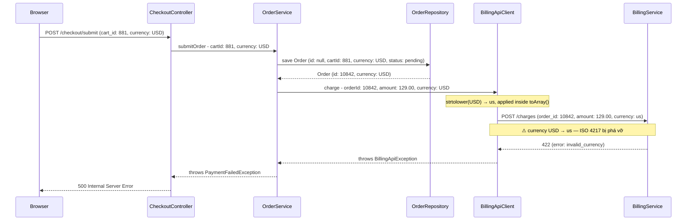
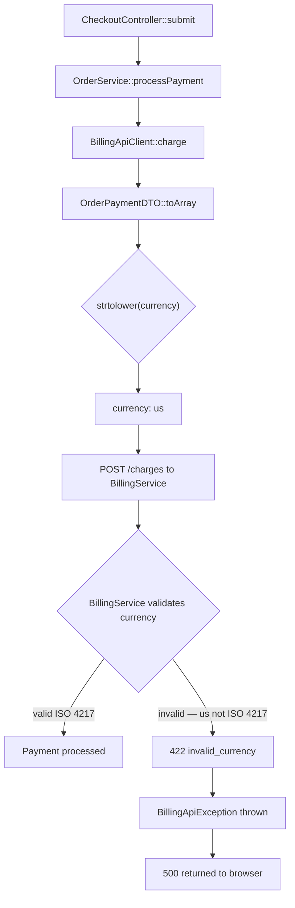

# Báo Cáo Debugger

## Title

Currency bị transform sai khi gửi sang BillingService — `"USD"` thành `"us"`

## Date

`2025-06-15`

## Environment

Production. Branch `main`, commit `a3f9c21`. Laravel 11, PHP 8.3. BillingService là external microservice (Node.js).

## Symptom

Tất cả đơn hàng tạo sau 14:00 ngày 15/06 đều fail ở bước thanh toán với lỗi 422 từ BillingService. Khoảng 340 đơn bị ảnh hưởng. Khách hàng không hoàn tất được checkout.

## Expected Behavior

BillingService nhận `currency: "USD"` và xử lý thanh toán thành công.

## Evidence

**Evidence level**: `Stack trace or runtime exception`

```
[2025-06-15 14:03:21] production.ERROR: BillingApiException: Invalid currency code
  at App\Infrastructure\Http\BillingApiClient::charge (BillingApiClient.php:87)
  at App\Application\Service\OrderService::processPayment (OrderService.php:134)
  at App\Http\Controllers\CheckoutController::submit (CheckoutController.php:62)

Response from BillingService:
HTTP 422 Unprocessable Entity
{"error": "invalid_currency", "message": "Currency code 'us' is not supported. Expected ISO 4217 format."}
```

Outbound payload captured via debug log:
```json
{
  "order_id": 10842,
  "amount": 129.00,
  "currency": "us",
  "customer_id": "cust_9921"
}
```

## Trace Entry

`App\Http\Controllers\CheckoutController::submit` — POST `/checkout/submit`

## Data Flow



## Data Mapping Analysis

| Boundary | Source Shape | Target Shape | Mapping / Transformation | Status | Notes |
|----------|--------------|--------------|--------------------------|--------|-------|
| Browser → CheckoutController | `currency: "USD"` (string) | `CheckoutRequest->currency: "USD"` | Laravel form binding, no transform | OK | |
| CheckoutController → OrderService | `CheckoutRequest->currency: "USD"` | `submitOrder($request->currency)` | Pass-through | OK | |
| OrderService → OrderRepository | `Order->currency: "USD"` | `orders.currency = "USD"` | Eloquent mapping, no transform | OK | |
| OrderService → BillingApiClient | `OrderPaymentDTO->currency: "USD"` | `toArray()["currency"]` | **`strtolower()` applied** | **Mismatch** | BillingApiClient.php:71 — `strtolower` biến "USD" thành "us" |
| BillingApiClient → BillingService | `currency: "us"` | expects `currency: "USD"` (ISO 4217) | No further transform | Mismatch | BillingService chỉ accept uppercase ISO 4217 |

**Boundary đầu tiên có Mismatch**: `OrderService → BillingApiClient` tại `BillingApiClient::toArray()` line 71.

## Logic Flow



## Confirmed Facts

- `BillingApiClient::toArray()` tại line 71 gọi `strtolower($this->currency)` — xác nhận bằng code inspection.
- BillingService từ chối `"us"`, chỉ accept uppercase ISO 4217 — xác nhận từ error response và BillingService API docs.
- Các đơn hàng trước 14:00 không bị lỗi — git log cho thấy `BillingApiClient.php` được sửa trong commit `a3f9c21` lúc 13:47, thêm `strtolower()` để "normalize" currency.

## Rủi ro

**Severity**: `Critical`

**Trigger conditions**: Xảy ra với 100% đơn hàng tạo sau commit `a3f9c21` (14:00 ngày 15/06). Không cần điều kiện đặc biệt — tất cả currency đều bị lowercase.

**Hậu quả**: Toàn bộ checkout flow bị chặn — khách hàng không thể thanh toán. 340 đơn đã fail. Revenue bị gián đoạn hoàn toàn cho đến khi fix được deploy.
