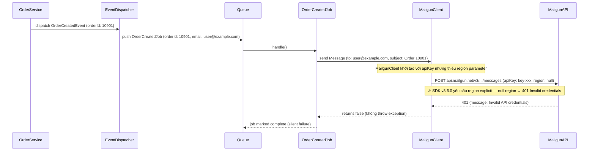
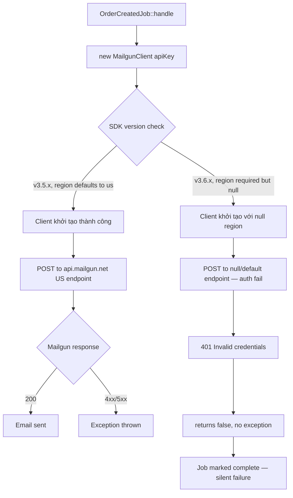

# Báo Cáo Debugger

## Title

Email thông báo đơn hàng mới ngừng gửi sau deploy ngày 12/06 — Mailgun SDK breaking change

## Date

`2025-06-14`

## Environment

Production. Branch `main`, commit `d8e1b04` (deploy 12/06 15:30). Laravel 11, PHP 8.3. Mail provider: Mailgun.

## Symptom

Email thông báo "Đơn hàng mới" không được gửi đến khách hàng kể từ 15:30 ngày 12/06. Không có error trong application logs. Queue worker chạy bình thường, jobs được dispatch và consumed nhưng email không đến inbox. Khoảng 1,200 email bị drop trong 18 tiếng.

## Expected Behavior

Sau khi đơn hàng được tạo, `OrderCreatedJob` dispatch thành công và Mailgun gửi email xác nhận đến khách trong vòng 30 giây.

## Evidence

**Evidence level**: `Logs with correlation`

Application log — không có exception từ mail layer:
```
[2025-06-12 15:41:02] production.INFO: OrderCreatedJob dispatched {"order_id":10901,"email":"user@example.com"}
[2025-06-12 15:41:04] production.INFO: OrderCreatedJob processed successfully {"order_id":10901}
```

Mailgun Activity Log (lấy từ Mailgun dashboard):
```
2025-06-12 15:41:05  FAILED  to: user@example.com
  reason: "Invalid API credentials"
  http_status: 401
```

Mailgun trả 401 nhưng Laravel không throw exception — log chỉ thấy "processed successfully".

git log trên notification path — không có thay đổi code:
```
$ git log --oneline app/Mail/ app/Jobs/OrderCreatedJob.php
b2c9a10  feat: add order summary to email template  (3 weeks ago)
```

composer.lock diff giữa commit trước deploy và `d8e1b04`:
```diff
- "mailgun/mailgun-php": "3.5.2"
+ "mailgun/mailgun-php": "3.6.0"
```

Mailgun PHP SDK changelog v3.6.0:
```
BREAKING: HttpClient now requires explicit region parameter.
Default region removed. Pass 'us' or 'eu' explicitly.
Constructor signature: __construct(string $apiKey, string $region)
```

## Trace Entry

`App\Jobs\OrderCreatedJob::handle()` — triggered via queue worker sau khi `OrderCreatedEvent` fired.

## Data Flow



## Data Mapping Analysis

| Boundary | Source Shape | Target Shape | Mapping / Transformation | Status | Notes |
|----------|--------------|--------------|--------------------------|--------|-------|
| OrderCreatedJob → MailgunClient | `Message { to, subject, body }` | Mailgun API payload | SDK handles serialization | OK | Payload đúng |
| MailgunClient constructor | `config('mail.mailers.mailgun.secret')` | `apiKey` param | Direct pass | OK | API key đúng |
| MailgunClient constructor | *(không có)* | `region` param | **Không được truyền** | **Mismatch** | SDK v3.6.0 bắt buộc region, trước đây default "us" |
| MailgunClient → MailgunAPI | `Authorization: Basic <key>` | validates against region endpoint | Region null → sai endpoint | Mismatch | API key hợp lệ nhưng sai region endpoint → 401 |

**Boundary đầu tiên có Mismatch**: `MailgunClient constructor` — thiếu `region` parameter sau khi upgrade SDK 3.5.2 → 3.6.0.

## Logic Flow



## Confirmed Facts

- `mailgun/mailgun-php` bumped từ `3.5.2` lên `3.6.0` trong `composer.lock` tại commit `d8e1b04` — xác nhận từ git diff.
- SDK v3.6.0 bỏ default region, bắt buộc truyền explicit — xác nhận từ SDK changelog.
- Mailgun API trả 401 cho tất cả mail requests từ 15:30 ngày 12/06 — xác nhận từ Mailgun dashboard activity log.
- Application không log exception vì `MailgunClient::send()` trả `false` thay vì throw khi nhận 401 — xác nhận bằng code inspection SDK v3.6.0.

## Rủi ro

**Severity**: `Critical`

**Trigger conditions**: Xảy ra với 100% email dispatch kể từ khi deploy commit `d8e1b04` (15:30 ngày 12/06). Không cần điều kiện đặc biệt — mọi `MailgunClient` call đều 401. Đặc biệt nguy hiểm vì là **silent failure** — application log không có error, jobs đều "success".

**Hậu quả**: ~1,200 email bị drop trong 18 tiếng (order confirmation, password reset, invoice). Khách hàng không nhận được xác nhận đơn hàng. `SubscriptionRenewalJob` và `InvoiceJob` cũng bị ảnh hưởng — có thể gây churn và tranh chấp thanh toán nếu không xử lý kịp.
