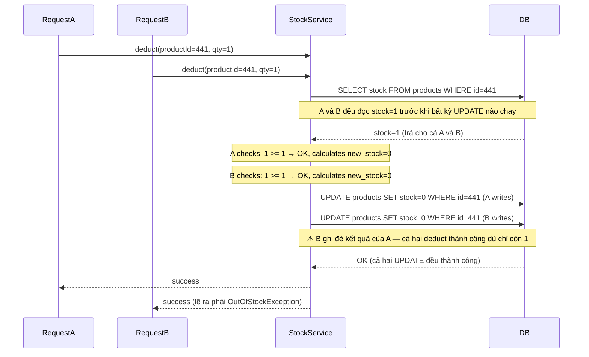
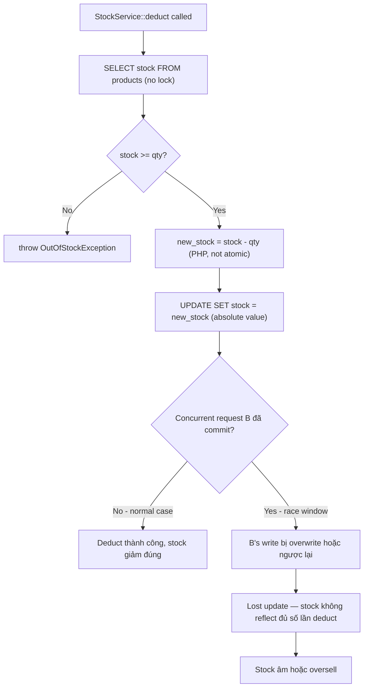

# Báo Cáo Debugger

## Title

Inventory âm trong flash sale — race condition giữa read và decrement trong StockService::deduct()

## Date

`2025-06-20`

## Environment

Production. Branch `main`, commit `f1a8e33`. Laravel 11, PHP 8.3, MySQL 8.0. Flash sale event ngày 20/06 từ 12:00–13:00, ~800 concurrent users.

## Symptom

Trong flash sale, `stock` của một số sản phẩm xuống âm (ví dụ: `-3`, `-7`). Khách hàng đặt hàng thành công dù stock đã hết. Hệ thống không trả lỗi "out of stock". Phát hiện qua báo cáo inventory sau event.

## Expected Behavior

Khi `stock = 1`, chỉ đúng một đơn hàng được xử lý thành công. Các request đến sau phải nhận lỗi "out of stock".

## Evidence

**Evidence level**: `Logs with correlation`

DB snapshot sau flash sale — một số sản phẩm có stock âm:
```sql
SELECT product_id, stock FROM products WHERE stock < 0;
-- product_id: 441, stock: -3
-- product_id: 558, stock: -7
-- product_id: 612, stock: -1
```

Application log — nhiều request deduct cùng lúc, không có lỗi:
```
[2025-06-20 12:00:03.041] INFO: StockService::deduct product_id=441 current_stock=4
[2025-06-20 12:00:03.043] INFO: StockService::deduct product_id=441 current_stock=4
[2025-06-20 12:00:03.044] INFO: StockService::deduct product_id=441 current_stock=4
[2025-06-20 12:00:03.047] INFO: StockService deducted product_id=441 new_stock=3
[2025-06-20 12:00:03.047] INFO: StockService deducted product_id=441 new_stock=3
[2025-06-20 12:00:03.048] INFO: StockService deducted product_id=441 new_stock=3
```

`StockService::deduct()` hiện tại (code inspection):
```php
public function deduct(int $productId, int $qty): void
{
    $product = Product::find($productId);  // SELECT stock

    if ($product->stock < $qty) {
        throw new OutOfStockException();
    }

    $product->stock -= $qty;  // calculate in PHP
    $product->save();         // UPDATE products SET stock = {calculated}
}
```

## Trace Entry

`App\Application\Service\StockService::deduct()` — gọi từ `OrderService::createOrder()` trong queue job.

## Data Flow



## Data Mapping Analysis

| Boundary | Source Shape | Target Shape | Mapping / Transformation | Status | Notes |
|----------|--------------|--------------|--------------------------|--------|-------|
| DB → StockService (read) | `products.stock = 1` | `$product->stock = 1` | Eloquent SELECT | OK | |
| StockService check | `stock=1, qty=1` | `1 >= 1 → true` | PHP comparison | OK | Check đúng tại thời điểm đọc |
| StockService compute | `stock=1, qty=1` | `new_stock = 0` | PHP subtraction | OK | Phép tính đúng |
| StockService → DB (write) | `new_stock=0` | `UPDATE SET stock=0` | Eloquent save | **Mismatch** | Ghi giá trị tuyệt đối thay vì atomic decrement — B ghi đè A |
| DB state sau 2 writes | stock=0 (A writes), stock=0 (B writes) | Expected: stock=-1 detected | No optimistic lock | **Mismatch** | Không có lock → lost update — cả hai thành công với stock=1 |

**Boundary có Mismatch**: `StockService → DB (write)` — ghi giá trị tuyệt đối (`SET stock = 0`) thay vì atomic decrement (`SET stock = stock - 1`).

## Logic Flow



## Confirmed Facts

- `StockService::deduct()` đọc stock bằng `Product::find()` không có `lockForUpdate()` — xác nhận bằng code inspection.
- UPDATE dùng giá trị tuyệt đối (`$product->stock -= $qty; $product->save()`) thay vì `UPDATE products SET stock = stock - $qty` — xác nhận bằng code inspection.
- Log timestamp cho thấy nhiều `deduct` cho cùng `product_id` đọc cùng `current_stock=4` trước khi UPDATE nào chạy — xác nhận race window thực sự xảy ra.
- DB không có constraint `CHECK (stock >= 0)` — xác nhận bằng schema inspection.

## Rủi ro

**Severity**: `High`

**Trigger conditions**: Xảy ra khi có ≥ 2 concurrent requests deduct cùng một `product_id` trong cùng thời điểm. Xác suất tăng theo concurrent load — flash sale (~800 users/giờ) là worst case. Với traffic bình thường (~50 users/giờ) race window hẹp hơn nhưng vẫn có thể xảy ra.

**Hậu quả**: Stock âm — sản phẩm hết hàng nhưng vẫn cho đặt thành công. Dẫn đến oversell, phải hoàn tiền thủ công, và damage uy tín. Lần này ít nhất 3 sản phẩm bị âm stock trong flash sale. `ReservationService` cũng dùng cùng `StockService::deduct()` — reservation flow có cùng rủi ro.
