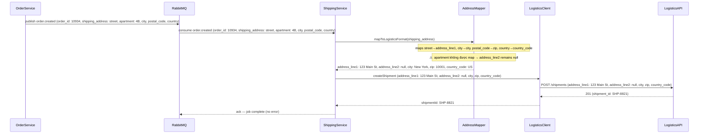
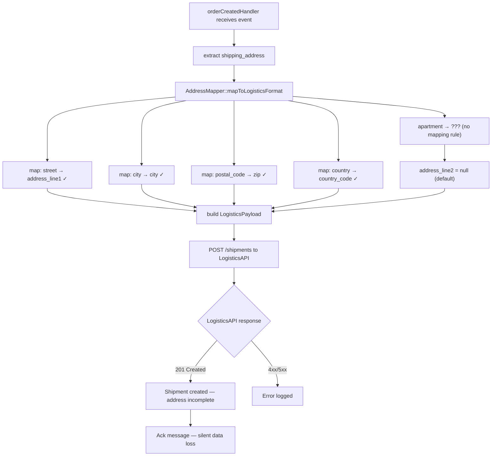

# Báo Cáo Debugger

## Title

Địa chỉ giao hàng thiếu apartment number khi truyền từ OrderService sang ShippingService

## Date

`2025-06-18`

## Environment

Production. Microservice architecture. OrderService (Laravel 11, PHP 8.3) → ShippingService (Node.js 20, Express) → LogisticsProvider API (third-party). Giao tiếp qua REST/JSON. Phát hiện từ báo cáo của logistics partner.

## Symptom

Khoảng 12% đơn hàng trong tháng 6 bị giao nhầm hoặc trả lại do địa chỉ thiếu `apartment` / `unit number`. Khách hàng xác nhận đã nhập đầy đủ khi checkout. Dữ liệu trong DB của OrderService lưu đúng.

## Expected Behavior

Địa chỉ đầy đủ bao gồm `street`, `apartment`, `city`, `postal_code` được truyền chính xác từ OrderService → ShippingService → LogisticsProvider.

## Evidence

**Evidence level**: `Concrete wrong output with known input`

DB `orders` table — address đầy đủ:
```json
{
  "street": "123 Main St",
  "apartment": "4B",
  "city": "New York",
  "postal_code": "10001",
  "country": "US"
}
```

Payload gửi đến LogisticsProvider (captured từ ShippingService outbound log):
```json
{
  "recipient": {
    "address_line1": "123 Main St",
    "address_line2": null,
    "city": "New York",
    "zip": "10001",
    "country_code": "US"
  }
}
```

`apartment: "4B"` bị drop, `address_line2` là `null`.

OrderService → ShippingService event payload (captured từ message queue log):
```json
{
  "order_id": 10934,
  "shipping_address": {
    "street": "123 Main St",
    "apartment": "4B",
    "city": "New York",
    "postal_code": "10001",
    "country": "US"
  }
}
```

ShippingService nhận đúng `apartment: "4B"` từ queue — mất trong ShippingService.

## Trace Entry

`ShippingService/src/handlers/orderCreatedHandler.js` — consume event `order.created` từ RabbitMQ queue.

## Data Flow



## Data Mapping Analysis

| Boundary | Source Shape | Target Shape | Mapping / Transformation | Status | Notes |
|----------|--------------|--------------|--------------------------|--------|-------|
| OrderService DB → event payload | `address { street, apartment, city, postal_code, country }` | `shipping_address { street, apartment, city, postal_code, country }` | Direct serialization | OK | `apartment: "4B"` có trong event |
| RabbitMQ → ShippingService | `shipping_address { ..., apartment: "4B", ... }` | `shipping_address { ..., apartment: "4B", ... }` | JSON parse, no transform | OK | ShippingService nhận đúng |
| ShippingService → AddressMapper | `{ street, apartment: "4B", city, postal_code, country }` | `{ address_line1, address_line2, city, zip, country_code }` | `mapToLogisticsFormat()` | **Mismatch** | `apartment` không có mapping rule → `address_line2` = null |
| AddressMapper → LogisticsClient | `{ address_line1: "123 Main St", address_line2: null, ... }` | POST /shipments body | Pass-through | OK | Đúng nhưng đã mất apartment ở bước trước |
| LogisticsClient → LogisticsAPI | `address_line2: null` | In delivery label | null → omitted on label | Mismatch | LogisticsProvider bỏ qua `null` fields trên label |

**Boundary đầu tiên có Mismatch**: `ShippingService → AddressMapper` trong `mapToLogisticsFormat()` — thiếu mapping rule `apartment → address_line2`.

## Logic Flow



## Confirmed Facts

- `apartment: "4B"` có trong event payload nhận từ RabbitMQ — xác nhận từ ShippingService inbound log.
- `AddressMapper::mapToLogisticsFormat()` không có mapping cho `apartment` field — xác nhận bằng code inspection `ShippingService/src/mappers/addressMapper.js`.
- LogisticsAPI nhận `address_line2: null` và bỏ qua trên delivery label — xác nhận từ logistics partner và API docs.
- OrderService lưu `apartment` đầy đủ trong DB — xác nhận bằng query trực tiếp.

## Rủi ro

**Severity**: `High`

**Trigger conditions**: Xảy ra với mọi đơn hàng có `apartment` / `unit number` trong địa chỉ giao hàng — ước tính 12% tổng đơn. Không phụ thuộc vào load hay timing, lỗi xảy ra 100% với địa chỉ có apartment. Tất cả carriers (FedEx, UPS, DHL) đều đi qua `mapToLogisticsFormat()` nên đều bị ảnh hưởng. `ReturnService` cũng dùng mapper này — return label cũng thiếu apartment.

**Hậu quả**: Giao hàng fail hoặc trả lại — khách không nhận được hàng, phải giao lại (phát sinh chi phí logistics), và giảm NPS. Lỗi tồn tại âm thầm vì ShippingService ack message thành công sau khi LogisticsAPI trả 201 — không có error log, không có alert.
