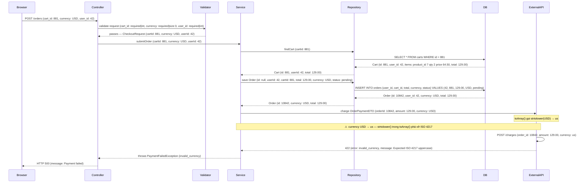
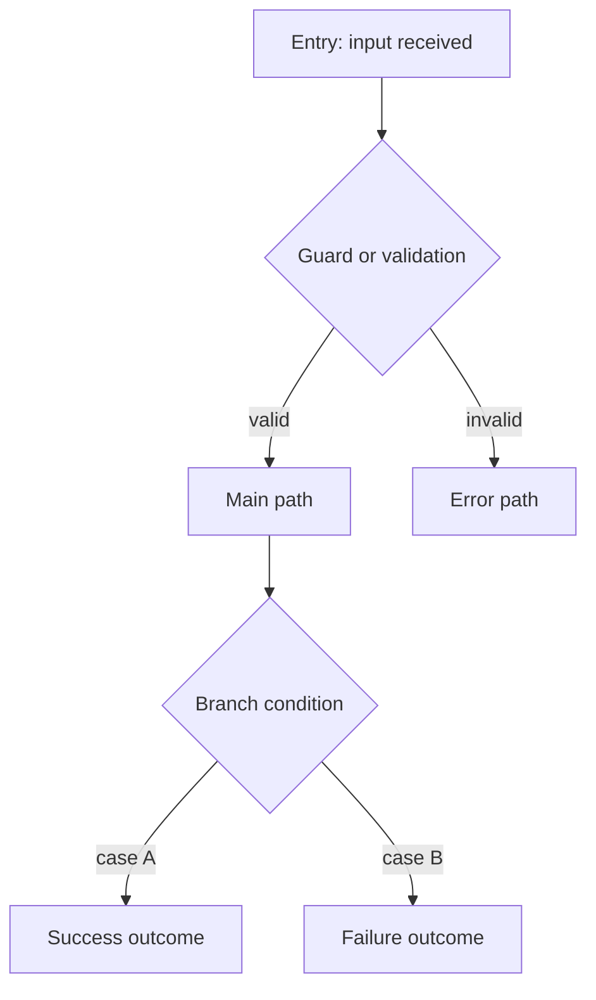

# Báo Cáo Debugger

Viết nội dung bằng tiếng Việt. Giữ nguyên technical terms bằng English, gồm code identifiers, API fields, protocol names, schema names, enum values, và các section keys.

## Title

Tiêu đề ngắn gọn cho defect.

## Date

`YYYY-MM-DD`

## Environment

Môi trường và version nơi bug xảy ra: dev / staging / prod, branch, commit hash nếu có.

## Symptom

Mô tả cái gì đang hỏng, xuất hiện ở đâu, và ảnh hưởng đến ai.

## Expected Behavior

Hành vi đúng lẽ ra phải xảy ra.

## Evidence

**Evidence level** (ghi mức mạnh nhất): `Deterministic failing test` / `Reliable local reproduction` / `Stack trace or runtime exception` / `Logs with correlation` / `Concrete wrong output with known input` / `Code inspection only`

Paste raw artifacts trực tiếp — không paraphrase:

- stack trace / exception
- wrong output vs expected output
- logs with correlation ID / timestamps
- payload (request / response)
- user steps to reproduce
- git diff or blame on the critical path

## Trace Entry

File, function, request path, job, worker, command, hoặc stack frame chính xác nơi bắt đầu trace.

## Data Flow

Mỗi participant là một layer riêng biệt. Mỗi mũi tên ghi: tên method/endpoint + toàn bộ payload liên quan (field names, types, actual values). Ghi rõ return value ở từng bước. Dùng `Note` để đánh dấu transformation xảy ra bên trong một participant. Đánh dấu điểm mismatch bằng `Note over X,Y: ⚠`.

## Data Mapping Analysis

| Boundary | Source Shape | Target Shape | Mapping / Transformation | Status | Notes |
|----------|--------------|--------------|--------------------------|--------|-------|
| controller -> service | | | | | |
| service -> repository | | | | | |
| service A -> service B | | | | | |

`OK` = mapping đúng, `Mismatch` = mapping sai. Kiểm tra: field renames, drops, type casts, enum/status translation, unit conversions, null/empty semantics, nested paths, semantic reinterpretation. Chỉ rõ boundary đầu tiên có Mismatch.

## Logic Flow

## Confirmed Facts

Fact có backing từ test, trace, log, hoặc direct code evidence:

- Fact 1

## Rủi ro

**Severity**: `Critical` / `High` / `Medium` / `Low`

**Trigger conditions**: điều kiện cụ thể kích hoạt bug (ví dụ: chỉ xảy ra khi concurrent requests > N, hoặc khi field X có giá trị Y, hoặc sau khi dependency được upgrade).

**Hậu quả**: mô tả tác động thực tế — data loss, service outage, financial impact, user impact, silent failure không log, v.v.
