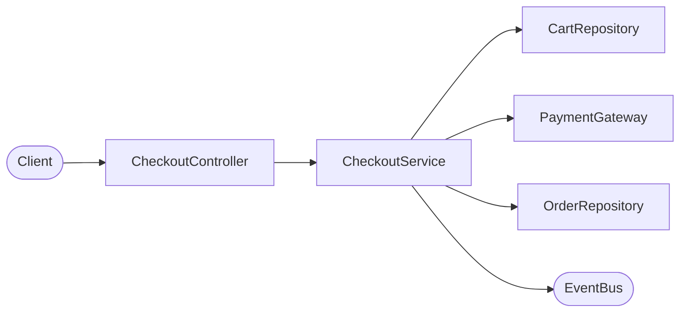
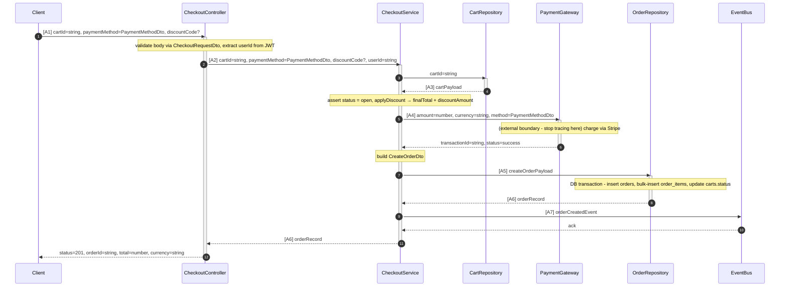
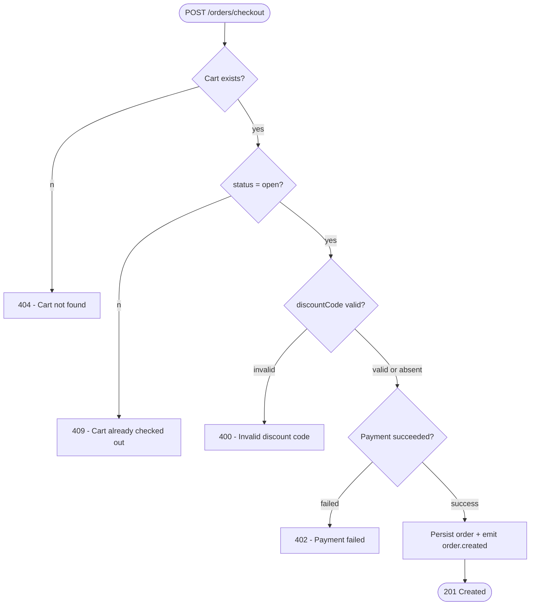

# Flow: checkout

- **Feature:** checkout
- **Entry point:** `src/api/orders/checkout.controller.ts` → `CheckoutController.create`

---

## Lịch sử chỉnh sửa

| Ngày | Thay đổi | Bởi |
| --- | --- | --- |
| 2026-07-12 | Tạo mới | generate-flow |

---

## Flow Summary

Client gửi POST request với thông tin giỏ hàng và phương thức thanh toán. Service kiểm tra trạng thái giỏ hàng, áp dụng mã giảm giá nếu có, thực hiện thanh toán qua Stripe, lưu đơn hàng, và publish event `order.created`.



| # | Bước | Mô tả |
| --- | --- | --- |
| 1 | Nhận request | Controller validate body, lấy userId từ JWT |
| 2 | Load giỏ hàng | Service truy vấn giỏ hàng, kiểm tra trạng thái open |
| 3 | Tính tổng tiền | Áp dụng discount code, tính finalTotal |
| 4 | Thanh toán | Gọi Stripe qua PaymentGateway |
| 5 | Lưu đơn hàng | Insert orders + order_items, cập nhật trạng thái giỏ hàng |
| 6 | Phát sự kiện | Publish `order.created` lên EventBus |
| 7 | Trả phản hồi | Controller trả về 201 với orderId và total |

---

## Full Flow

### Path: POST /orders/checkout



#### Chú thích dữ liệu

**[A1]** `Client` → `CheckoutController` — raw HTTP body:
```
cartId: string              // required; format: uuid
paymentMethod: PaymentMethodDto  // required; { type: "credit_card" | "paypal", token: string }
discountCode?: string       // optional; maxLength: 20
```

**[A2]** `CheckoutController` → `CheckoutService` — sau khi thêm userId từ JWT:
```
cartId: string              // giữ nguyên từ [A1]
paymentMethod: PaymentMethodDto  // giữ nguyên từ [A1]
discountCode?: string       // giữ nguyên từ [A1]
userId: string              // tạo mới; extract từ JWT bởi @CurrentUser(); format: uuid
```

**[A3]** `CartRepository` → `CheckoutService` — giỏ hàng từ DB:
```
id: string                  // required; format: uuid
userId: string              // required; format: uuid
status: "open" | "checked_out"  // required; phải là "open" để tiếp tục
currency: string            // required; ISO 4217
items: CartItem[]           // required; min length: 1
createdAt: Date             // required
```

**[A4]** `CheckoutService` → `PaymentGateway` — payload thanh toán:
```
amount: number              // derive từ Cart.items + applyDiscount(); đơn vị: cents; > 0
currency: string            // giữ nguyên từ [A3] Cart.currency
method: PaymentMethodDto    // giữ nguyên từ [A2] paymentMethod
```

**[A5]** `CheckoutService` → `OrderRepository` — CreateOrderDto:
```
userId: string              // giữ nguyên từ [A2]
cartId: string              // giữ nguyên từ [A2]
total: number               // derive: finalTotal sau discount
currency: string            // giữ nguyên từ [A3]
transactionId: string       // tạo mới; từ PaymentGateway response
items: CartItem[]           // giữ nguyên từ [A3] Cart.items
discountCode?: string       // bị loại bỏ tại bước này; đã được áp dụng vào total
discountAmount: number      // bị loại bỏ tại bước này; không lưu vào Order
```

**[A6]** `OrderRepository` → `CheckoutService` — Order đã lưu:
```
id: string                  // tạo mới; uuid do DB generate
userId: string              // giữ nguyên từ [A5]
total: number               // giữ nguyên từ [A5]
currency: string            // giữ nguyên từ [A5]
status: "pending"           // tạo mới; DB default; enum: "pending" | "paid" | "failed" | "cancelled"
transactionId: string       // giữ nguyên từ [A5]
createdAt: Date             // tạo mới; DB default now()
```

**[A7]** `CheckoutService` → `EventBus` — payload event order.created:
```
orderId: string             // từ [A6] Order.id
userId: string              // giữ nguyên từ [A2]
total: number               // giữ nguyên từ [A6] Order.total
```

#### Sơ đồ quyết định



---

## Điểm kết thúc

| Loại | Mô tả | File | Function |
| --- | --- | --- | --- |
| External API | Charge via Stripe qua PaymentGateway | `src/payments/payment.gateway.ts` | `PaymentGateway.charge` |
| DB Write | Insert dòng vào bảng `orders` | `src/orders/order.repository.ts` | `OrderRepository.create` |
| DB Write | Bulk-insert vào bảng `order_items` | `src/orders/order.repository.ts` | `OrderRepository.create` |
| DB Write | Cập nhật `carts.status = "checked_out"` | `src/orders/order.repository.ts` | `OrderRepository.create` |
| Event | `order.created` publish lên exchange `orders` | `src/orders/checkout.service.ts` | `CheckoutService.checkout` |
| Response | `201` với `{ orderId, total, currency, status: "pending" }` | `src/api/orders/checkout.controller.ts` | `CheckoutController.create` |

---

## Câu hỏi còn mở

- [ ] `applyDiscount` có kiểm tra ngày hết hạn của mã giảm giá không, hay chỉ kiểm tra chuỗi mã?
- [ ] Event `order.created` được publish bên trong DB transaction hay sau khi commit?
