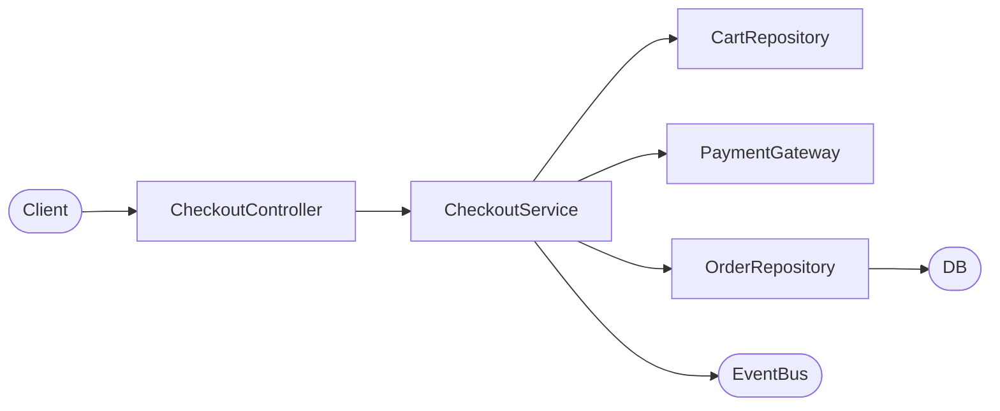
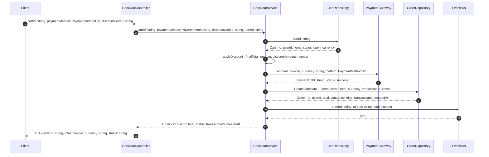
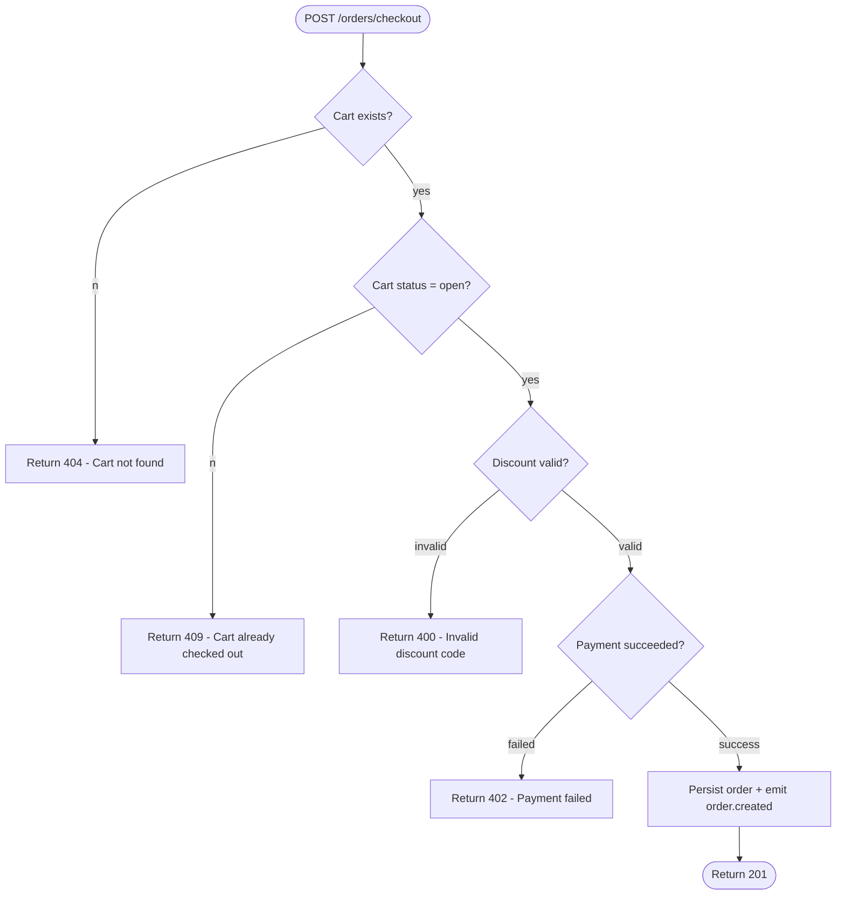

# Flow: checkout

- **Feature:** checkout
- **Entry point:** `src/api/orders/checkout.controller.ts` → `CheckoutController.create`
- **Generated:** 2026-07-11
- **Author:** generate-flow skill

---

## Lịch sử chỉnh sửa

| Ngày | Thay đổi | Bởi |
| --- | --- | --- |
| 2026-07-11 | Tạo mới | generate-flow |

---

## Tóm tắt

Client gửi POST request với thông tin giỏ hàng và phương thức thanh toán đến `/orders/checkout`. Service kiểm tra giỏ hàng đang ở trạng thái mở, áp dụng mã giảm giá nếu có, thực hiện thanh toán qua Stripe, và lưu đơn hàng trong một DB transaction. Sau khi thành công, event `order.created` được publish và client nhận phản hồi 201 với order ID và tổng tiền cuối cùng.



### Các bước chính

| # | Layer | Điều gì xảy ra | Data shape |
| --- | --- | --- | --- |
| 1 | CheckoutController | Validate body, lấy userId từ JWT | cartId: string, paymentMethod: PaymentMethodDto, discountCode?: string |
| 2 | CheckoutService | Load giỏ hàng, kiểm tra trạng thái mở | Cart { id, userId, items: CartItem[], status: "open" \| "checked_out", currency } |
| 3 | CheckoutService | Áp dụng mã giảm giá, tính tổng tiền cuối | finalTotal: number, discountAmount: number |
| 4 | PaymentGateway | Thanh toán qua Stripe, trả về transactionId | transactionId: string, status: "success" \| "failed" |
| 5 | OrderRepository | Insert đơn hàng và items, đánh dấu giỏ hàng đã thanh toán | Order { id, total, status: "pending", transactionId } |
| 6 | EventBus | Publish event order.created | orderId: string, userId: string, total: number |
| 7 | CheckoutController | Trả về 201 cho client | orderId: string, total: number, currency: string, status: string |

### Các thay đổi dữ liệu chính

| Field | Set by | Layer |
| --- | --- | --- |
| `cart.status` | `checkout.service.ts:68` | Service |
| `order.id` | `order.repository.ts:34` | Repository |
| `order.status` | `order.repository.ts:34` | Repository |
| `order.transactionId` | `checkout.service.ts:72` | Service |
| `order.total` | `checkout.service.ts:55` | Service |

---

## Flow đầy đủ

### Path: POST /orders/checkout

#### Sơ đồ tuần tự



#### Quá trình biến đổi dữ liệu

| Layer | Snapshot dữ liệu |
| --- | --- |
| Controller đầu vào | `{ cartId: string, paymentMethod: PaymentMethodDto, discountCode?: string }` |
| Service — sau khi thêm userId | `{ cartId: string, paymentMethod: PaymentMethodDto, discountCode?: string, userId: string }` |
| Service — sau khi load giỏ hàng | `Cart { id: string, userId: string, items: CartItem[], status: "open" \| "checked_out", currency: string, createdAt: Date }` |
| Service — sau khi tính discount | `{ ...Cart, finalTotal: number, discountAmount: number }` |
| Service — sau khi thanh toán | `{ ...prev, transactionId: string }` |
| Repository — sau khi lưu đơn hàng | `Order { id: string (uuid), userId: string, total: number, currency: string, status: "pending", transactionId: string, createdAt: Date }` |
| Service — sau khi cập nhật giỏ hàng | `cart.status: "checked_out"` |
| Response | `{ orderId: string, total: number, currency: string, status: "pending" }` |

#### Sơ đồ quyết định



---

## Phân tích từng layer

### CheckoutController — API

**File:** `src/api/orders/checkout.controller.ts`
**Function:** `CheckoutController.create`

**Đầu vào:**
```
cartId: string              // required
paymentMethod: PaymentMethodDto  // required; { type: "credit_card" | "paypal", token: string }
discountCode?: string       // optional; maxLength: 20
userId: string              // required; extracted from JWT by @CurrentUser decorator; format: uuid
```

**Logic:**
1. Validate request body theo schema `CheckoutRequestDto` bằng class-validator.
2. Lấy `userId` từ JWT thông qua decorator `@CurrentUser()`.
3. Gọi `CheckoutService.checkout(cartId, paymentMethod, discountCode, userId)`.
4. Trả về HTTP 201 với kết quả từ service.

**Đầu ra:**
```
orderId: string             // required; format: uuid
total: number               // required; > 0; tổng tiền sau discount
currency: string            // required; ISO 4217 (e.g. "USD")
status: "pending"           // required; cố định là "pending" tại thời điểm tạo
```

**Side effects:** không có

---

### CheckoutService — Service

**File:** `src/orders/checkout.service.ts`
**Function:** `CheckoutService.checkout`

**Đầu vào:**
```
cartId: string              // required; format: uuid
paymentMethod: PaymentMethodDto  // required; { type: "credit_card" | "paypal", token: string }
discountCode?: string       // optional; nullable
userId: string              // required; format: uuid
```

**Logic:**
1. Load giỏ hàng qua `CartRepository.findByIdWithItems(cartId)`. Throw `NotFoundException` nếu không tìm thấy.
2. Kiểm tra `cart.status === 'open'`. Throw `ConflictException` nếu giỏ hàng đã thanh toán.
3. Gọi `applyDiscount(cart, discountCode)` để tính `finalTotal` và `discountAmount`.
4. Tạo `chargePayload { amount: finalTotal, currency: cart.currency, method: paymentMethod }`.
5. Thực hiện thanh toán qua `PaymentGateway.charge(chargePayload)`. Throw `PaymentException` nếu thất bại.
6. Tạo `orderData` và lưu qua `OrderRepository.create(orderData)`.
7. Publish event `order.created` lên `EventBus`.
8. Trả về `Order` đã lưu.

**Đầu ra:**
```
id: string                  // required; format: uuid; generated by DB
userId: string              // required; format: uuid
total: number               // required; > 0; post-discount
currency: string            // required; ISO 4217
status: "pending"           // required; enum: "pending" | "paid" | "failed" | "cancelled"
transactionId: string       // required; from Stripe
createdAt: Date             // required; set by DB
```

**Side effects:**
- Lưu một dòng vào bảng `orders` và N dòng vào `order_items`.
- Cập nhật `carts.status` thành `"checked_out"`.
- Publish event `order.created` lên exchange `orders`.

#### Bảng thay đổi dữ liệu

| Field | Type | Change | Trước | Sau | Source |
| --- | --- | --- | --- | --- | --- |
| `order.total` | `number` | DERIVE | — | tổng tiền sau khi trừ discount | `src/orders/checkout.service.ts:55` |
| `order.transactionId` | `string` | CREATE | — | string từ Stripe | `src/orders/checkout.service.ts:72` |
| `cart.status` | `"open" \| "checked_out"` | UPDATE | `"open"` | `"checked_out"` | `src/orders/checkout.service.ts:68` |

---

### CartRepository — Repository

**File:** `src/carts/cart.repository.ts`
**Function:** `CartRepository.findByIdWithItems`

**Đầu vào:**
```
cartId: string              // required; format: uuid
```

**Logic:**
1. Query bảng `carts` join với `cart_items` và `products` theo điều kiện `id = cartId`.
2. Trả về `null` nếu không tìm thấy.

**Đầu ra:**
```
id: string                  // required; format: uuid
userId: string              // required; format: uuid
status: "open" | "checked_out"  // required; enum
currency: string            // required; ISO 4217
items: CartItem[]           // required; có thể là mảng rỗng
createdAt: Date             // required
```

**Side effects:** không có

---

### PaymentGateway — External

**File:** `src/payments/payment.gateway.ts`
**Function:** `PaymentGateway.charge`

**Đầu vào:**
```
amount: number              // required; > 0; đơn vị: cents
currency: string            // required; ISO 4217
method: PaymentMethodDto    // required; { type: "credit_card" | "paypal", token: string }
```

**Logic:**
1. Chuyển đổi dữ liệu sang định dạng Stripe PaymentIntent.
2. Gọi `stripe.paymentIntents.create(...)`.
3. Trả về transactionId và status nếu thành công; throw `PaymentException` nếu bị từ chối hoặc timeout.

**Đầu ra:**
```
transactionId: string       // required; Stripe payment intent ID
status: "success" | "failed"  // required; enum
```

**Side effects:** Thực hiện giao dịch thực trên tài khoản Stripe. Đây là terminal — không trace tiếp.

---

### OrderRepository — Repository

**File:** `src/orders/order.repository.ts`
**Function:** `OrderRepository.create`

**Đầu vào:**
```
userId: string              // required; format: uuid
cartId: string              // required; format: uuid
total: number               // required; > 0
currency: string            // required; ISO 4217
transactionId: string       // required; Stripe payment intent ID
items: CartItem[]           // required; min length: 1
```

**Logic:**
1. Mở một DB transaction.
2. Insert vào bảng `orders` — DB tạo `id` (uuid), gán `status = "pending"`, `createdAt = now()`.
3. Bulk-insert vào bảng `order_items` (một dòng cho mỗi item).
4. Cập nhật `carts.status = 'checked_out'` theo `cartId`.
5. Commit transaction.

**Đầu ra:**
```
id: string                  // required; format: uuid; generated by DB
userId: string              // required; format: uuid
total: number               // required; > 0
currency: string            // required; ISO 4217
status: "pending"           // required; enum: "pending" | "paid" | "failed" | "cancelled"
transactionId: string       // required
createdAt: Date             // required; set by DB default
```

**Side effects:** 3 DB write (orders, order_items, carts) trong một transaction.

#### Bảng thay đổi dữ liệu

| Field | Type | Change | Trước | Sau | Source |
| --- | --- | --- | --- | --- | --- |
| `order.id` | `string (uuid)` | CREATE | — | uuid do DB tạo | `src/orders/order.repository.ts:34` |
| `order.status` | `"pending" \| "paid" \| "failed" \| "cancelled"` | CREATE | — | `"pending"` | `src/orders/order.repository.ts:34` |
| `order.createdAt` | `Date` | CREATE | — | timestamp hiện tại (DB default) | `src/orders/order.repository.ts:34` |
| `cart.status` | `"open" \| "checked_out"` | UPDATE | `"open"` | `"checked_out"` | `src/orders/order.repository.ts:41` |

---

## Điểm kết thúc

| Loại | Mô tả | File | Function |
| --- | --- | --- | --- |
| DB Write | Insert dòng vào bảng `orders` | `src/orders/order.repository.ts` | `OrderRepository.create` |
| DB Write | Bulk-insert vào bảng `order_items` | `src/orders/order.repository.ts` | `OrderRepository.create` |
| DB Write | Cập nhật `carts.status = "checked_out"` | `src/orders/order.repository.ts` | `OrderRepository.create` |
| Event | `order.created` publish lên exchange `orders` | `src/orders/checkout.service.ts` | `CheckoutService.checkout` |
| Response | `201` — `{ orderId: string, total: number, currency: string, status: "pending" }` | `src/api/orders/checkout.controller.ts` | `CheckoutController.create` |

---

## Câu hỏi còn mở

- [ ] `applyDiscount` có kiểm tra ngày hết hạn của mã giảm giá không, hay chỉ kiểm tra chuỗi mã?
- [ ] Event `order.created` có được publish bên trong DB transaction không, hay sau khi commit?
