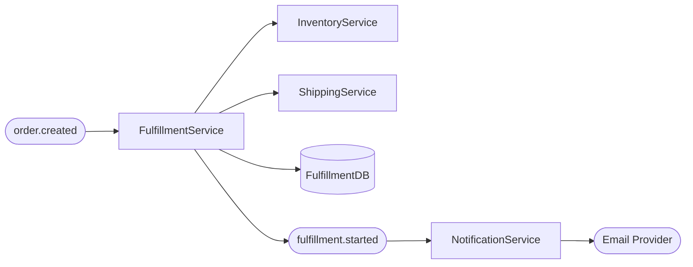
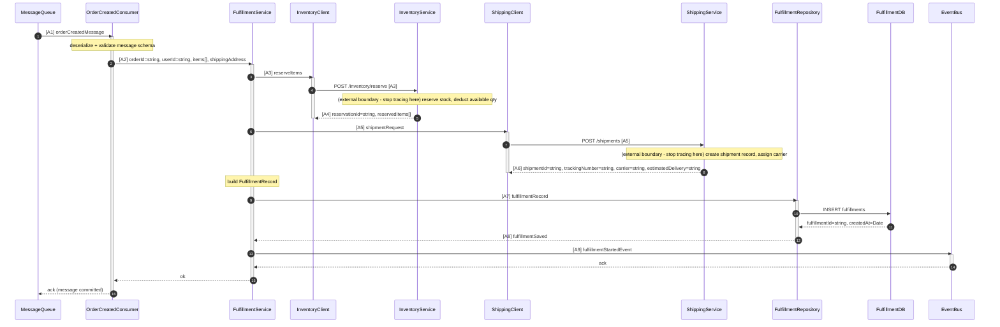
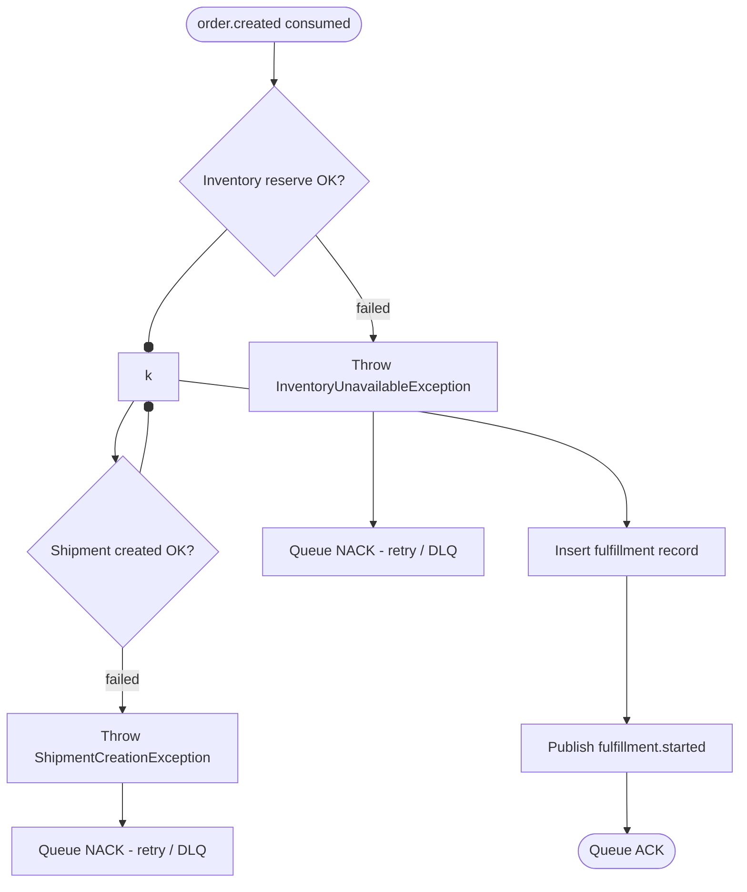
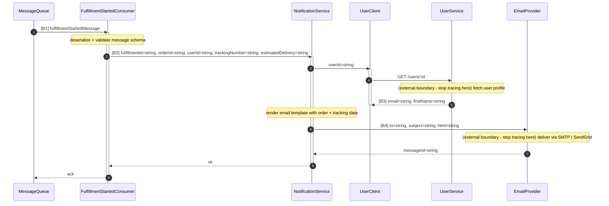

# Flow: order-fulfillment

- **Feature:** order-fulfillment
- **Entry point:** `fulfillment-service/src/consumers/order-created.consumer.ts` → `OrderCreatedConsumer.handle`

---

## Lịch sử chỉnh sửa

| Ngày | Thay đổi | Bởi |
| --- | --- | --- |
| 2026-07-12 | Tạo mới | generate-flow |

---

## Flow Summary

Khi event `order.created` được publish, Fulfillment Service tiêu thụ message, gọi Inventory Service để đặt giữ hàng tồn kho, gọi Shipping Service để tạo vận đơn, lưu fulfillment record, rồi publish event `fulfillment.started` để Notification Service gửi email xác nhận cho khách hàng.



| # | Bước | Mô tả |
| --- | --- | --- |
| 1 | Consume event | FulfillmentService nhận `order.created` từ message queue |
| 2 | Đặt giữ tồn kho | Gọi InventoryService HTTP API để reserve từng item |
| 3 | Tạo vận đơn | Gọi ShippingService HTTP API để tạo shipment và lấy tracking number |
| 4 | Lưu fulfillment | Insert fulfillment record vào DB |
| 5 | Publish event | Publish `fulfillment.started` lên message queue |
| 6 | Gửi thông báo | NotificationService consume event, gửi email xác nhận qua Email Provider |

---

## Full Flow

### Path: order.created (consumed by FulfillmentService)



#### Chú thích dữ liệu

**[A1]** `MessageQueue` → `OrderCreatedConsumer` — raw message payload:
```
eventType: "order.created"  // required
orderId: string             // required; format: uuid
userId: string              // required; format: uuid
items: OrderItem[]          // required; min length: 1; [{ productId, quantity, unitPrice }]
shippingAddress: Address    // required; { street, city, postalCode, country }
createdAt: string           // required; ISO 8601
```

**[A2]** `OrderCreatedConsumer` → `FulfillmentService` — sau khi deserialize và validate:
```
orderId: string             // giữ nguyên từ [A1]
userId: string              // giữ nguyên từ [A1]
items: OrderItem[]          // giữ nguyên từ [A1]
shippingAddress: Address    // giữ nguyên từ [A1]
eventType: —                // bị loại bỏ; không cần trong business logic
createdAt: —                // bị loại bỏ; không cần trong business logic
```

**[A3]** `FulfillmentService` → `InventoryService` — reserve request:
```
items: ReserveItem[]        // derive từ [A2] items; map sang [{ productId, quantity }]; unitPrice bị loại bỏ
```

**[A4]** `InventoryService` → `FulfillmentService` — reserve response (external boundary, không trace tiếp):
```
reservationId: string       // tạo mới; format: uuid; do InventoryService generate
reservedItems: ReservedItem[]  // tạo mới; [{ productId, quantity, warehouseId }]
```

**[A5]** `FulfillmentService` → `ShippingService` — create shipment request:
```
orderId: string             // giữ nguyên từ [A2]
reservationId: string       // giữ nguyên từ [A4]
items: ReservedItem[]       // giữ nguyên từ [A4] reservedItems
shippingAddress: Address    // giữ nguyên từ [A2]
```

**[A6]** `ShippingService` → `FulfillmentService` — shipment response (external boundary, không trace tiếp):
```
shipmentId: string          // tạo mới; format: uuid; do ShippingService generate
trackingNumber: string      // tạo mới; do carrier assign
carrier: string             // tạo mới; e.g. "DHL" | "FedEx" | "UPS"
estimatedDelivery: string   // tạo mới; ISO 8601 date
```

**[A7]** `FulfillmentService` → `FulfillmentRepository` — record cần lưu:
```
orderId: string             // giữ nguyên từ [A2]
userId: string              // giữ nguyên từ [A2]
reservationId: string       // giữ nguyên từ [A4]
shipmentId: string          // giữ nguyên từ [A6]
trackingNumber: string      // giữ nguyên từ [A6]
carrier: string             // giữ nguyên từ [A6]
estimatedDelivery: string   // giữ nguyên từ [A6]
status: "pending"           // tạo mới; hardcoded initial value
```

**[A8]** `FulfillmentRepository` → `FulfillmentService` — record đã lưu:
```
id: string                  // tạo mới; uuid do DB generate
orderId: string             // giữ nguyên từ [A7]
status: "pending"           // giữ nguyên từ [A7]
trackingNumber: string      // giữ nguyên từ [A7]
createdAt: Date             // tạo mới; DB default now()
```

**[A9]** `FulfillmentService` → `EventBus` — payload event fulfillment.started:
```
eventType: "fulfillment.started"  // tạo mới
fulfillmentId: string       // từ [A8] id
orderId: string             // giữ nguyên từ [A2]
userId: string              // giữ nguyên từ [A2]
trackingNumber: string      // giữ nguyên từ [A6]
estimatedDelivery: string   // giữ nguyên từ [A6]
```

#### Sơ đồ quyết định



---

### Path: fulfillment.started (consumed by NotificationService)



#### Chú thích dữ liệu

**[B1]** `MessageQueue` → `FulfillmentStartedConsumer` — raw message payload:
```
eventType: "fulfillment.started"  // required
fulfillmentId: string       // required; format: uuid
orderId: string             // required; format: uuid
userId: string              // required; format: uuid
trackingNumber: string      // required
estimatedDelivery: string   // required; ISO 8601 date
```

**[B2]** `FulfillmentStartedConsumer` → `NotificationService` — sau khi deserialize:
```
fulfillmentId: string       // giữ nguyên từ [B1]
orderId: string             // giữ nguyên từ [B1]
userId: string              // giữ nguyên từ [B1]
trackingNumber: string      // giữ nguyên từ [B1]
estimatedDelivery: string   // giữ nguyên từ [B1]
eventType: —                // bị loại bỏ
```

**[B3]** `UserService` → `NotificationService` — user info (external boundary, không trace tiếp):
```
email: string               // tạo mới; từ UserService
firstName: string           // tạo mới; từ UserService
```

**[B4]** `NotificationService` → `EmailProvider` — email payload:
```
to: string                  // derive từ [B3] email
subject: string             // tạo mới; rendered từ template
html: string                // tạo mới; render template với orderId, trackingNumber, estimatedDelivery, firstName
```

---

## Điểm kết thúc

| Loại | Mô tả | File | Function |
| --- | --- | --- | --- |
| External HTTP | POST `/inventory/reserve` — đặt giữ tồn kho tại InventoryService | `fulfillment-service/src/clients/inventory.client.ts` | `InventoryClient.reserve` |
| External HTTP | POST `/shipments` — tạo vận đơn tại ShippingService | `fulfillment-service/src/clients/shipping.client.ts` | `ShippingClient.createShipment` |
| DB Write | INSERT vào bảng `fulfillments` | `fulfillment-service/src/fulfillment/fulfillment.repository.ts` | `FulfillmentRepository.create` |
| Event | `fulfillment.started` publish lên exchange `fulfillments` | `fulfillment-service/src/fulfillment/fulfillment.service.ts` | `FulfillmentService.fulfill` |
| External HTTP | GET `/users/:id` — lấy thông tin user tại UserService | `notification-service/src/clients/user.client.ts` | `UserClient.findById` |
| External API | Gửi email qua Email Provider (SendGrid / SMTP) | `notification-service/src/notification/notification.service.ts` | `NotificationService.sendFulfillmentEmail` |

---

## Câu hỏi còn mở

- [ ] Khi InventoryService trả về lỗi, message có được NACK và đẩy vào DLQ không, hay chỉ retry vô hạn?
- [ ] FulfillmentService có rollback reservation tại InventoryService nếu ShippingService thất bại không?
- [ ] `fulfillment.started` có được publish bên trong DB transaction hay sau khi commit?
