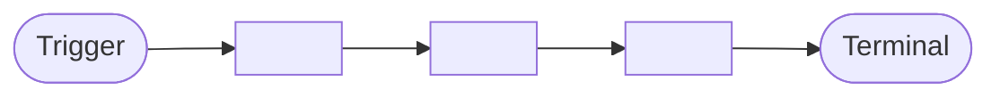
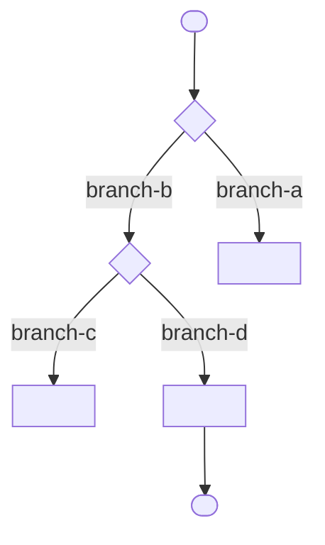

# Flow: {{feature-name}}

- **Feature:** {{feature-name}}
- **Entry point:** {{entry-points}}
- **Generated:** {{date}}
- **Author:** generate-flow skill

---

## Lịch sử chỉnh sửa

| Ngày | Thay đổi | Bởi |
| --- | --- | --- |
| {{date}} | Tạo mới | generate-flow |

---

## Tóm tắt

{{mô tả feature bằng tiếng Việt — tối đa 5 câu}}



### Các bước chính

| # | Layer | Điều gì xảy ra | Data shape |
| --- | --- | --- | --- |
| 1 | {{layer-1}} | {{mô tả ngắn}} | `{{data-shape}}` |
| 2 | {{layer-2}} | {{mô tả ngắn}} | `{{data-shape}}` |
| 3 | {{layer-3}} | {{mô tả ngắn}} | `{{data-shape}}` |

### Các thay đổi dữ liệu chính

| Field | Set by | Layer |
| --- | --- | --- |
| `{{field-name}}` | `{{file:line}}` | {{layer}} |

---

## Flow đầy đủ

### Path: {{path-name}}

#### Sơ đồ tuần tự

```mermaid
sequenceDiagram
    autonumber
    participant Trigger
    participant <LayerA>
    participant <LayerB>
    participant <LayerC>

    Trigger->><LayerA>: <field: type, field: type>
    <LayerA>->><LayerB>: <field: type, field: type>
    <LayerB>->><LayerC>: <field: type>
    <LayerC>-->><LayerB>: <field: type>
    <LayerB>-->><LayerA>: <field: type>
    <LayerA>-->>Trigger: <field: type>
```

#### Quá trình biến đổi dữ liệu

| Layer | Snapshot dữ liệu |
| --- | --- |
| {{layer-1}} đầu vào | `{ {{field}}: {{type}}, {{field}}: {{type}} }` |
| {{layer-2}} (sau {{transformation}}) | `{ ...prev, {{new-field}}: {{type}} }` |
| {{layer-3}} (đã lưu) | `{{Entity}} { {{field}}: {{type}}, {{field}}: {{type}} }` |
| Response | `{ {{field}}: {{type}}, {{field}}: {{type}} }` |

#### Sơ đồ quyết định



---

## Phân tích từng layer

### {{LayerA}} - {{layer-type}}

**File:** `{{file-path}}`
**Function:** `{{function-name}}`

**Đầu vào:**
```
fieldName: Type               // required
fieldName?: Type              // optional
fieldName: Type | null        // nullable
status: "a" | "b" | "c"      // enum
amount: number                // required; > 0
```

**Logic:**
1. {{bước 1}}
2. {{bước 2}}
3. {{bước 3}}

**Đầu ra:**
```
fieldName: Type               // required
fieldName?: Type              // optional
```

**Side effects:** {{mô tả hoặc "không có"}}

#### Bảng thay đổi dữ liệu

| Field | Type | Change | Trước | Sau | Source |
| --- | --- | --- | --- | --- | --- |
| `{{field-name}}` | `Type` | CREATE | — | `{{value}}` | `{{file:line}}` |
| `{{field-name}}` | `Type?` | UPDATE | `{{before}}` | `{{after}}` | `{{file:line}}` |

---

## Điểm kết thúc

| Loại | Mô tả | File | Function |
| --- | --- | --- | --- |
| DB Write | {{mô tả dữ liệu được lưu}} | `{{file-path}}` | `{{function-name}}` |
| Event | {{tên event}} publish đến `{{topic-or-queue}}` | `{{file-path}}` | `{{function-name}}` |
| Response | `{{status-code}}` với `{{response-shape}}` | `{{file-path}}` | `{{function-name}}` |

---

## Câu hỏi còn mở

- [ ] {{hành vi chưa xác định}}
