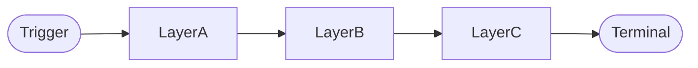
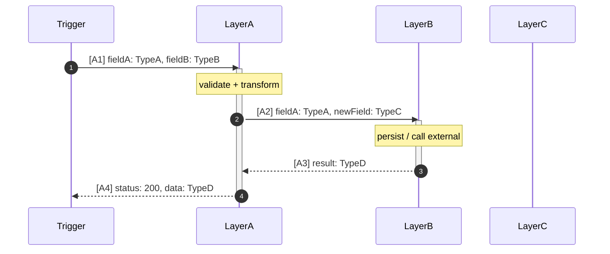
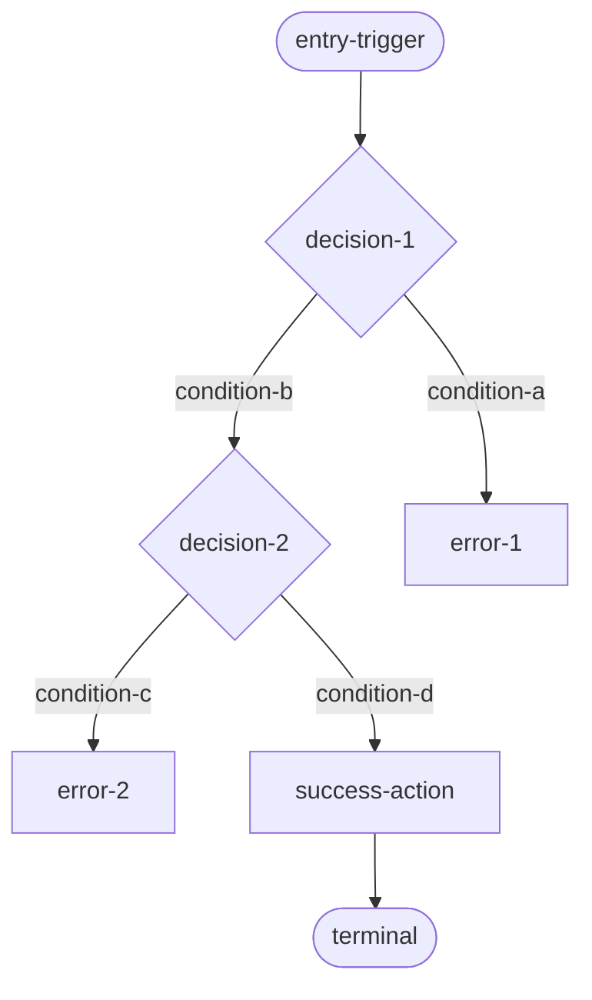

# Flow: {{feature-name}}

- **Feature:** {{feature-name}}
- **Entry point:** {{entry-points}}

---

## Lịch sử chỉnh sửa

| Ngày | Thay đổi | Bởi |
| --- | --- | --- |
| {{date}} | Tạo mới | generate-flow |

---

## Flow Summary

{{mô tả ngắn gọn logic flow — tối đa 3 câu, không cần nêu chi tiết data}}



| # | Bước | Mô tả |
| --- | --- | --- |
| 1 | {{bước-1}} | {{mô tả ngắn}} |
| 2 | {{bước-2}} | {{mô tả ngắn}} |
| 3 | {{bước-3}} | {{mô tả ngắn}} |

---

## Full Flow

### Path: {{path-name}}



#### Chú thích dữ liệu

**[A1]** `Trigger` → `LayerA` — raw input:
```
fieldA: TypeA               // required
fieldB?: TypeB              // optional
fieldC: "x" | "y" | "z"    // enum
```

**[A2]** `LayerA` → `LayerB` — sau validate & transform:
```
fieldA: TypeA               // giữ nguyên
newField: TypeC             // derive từ fieldA + fieldB
fieldB: —                   // bị loại bỏ sau validate
```

**[A3]** `LayerB` → `LayerA` — kết quả trả về:
```
result: TypeD               // tạo mới tại LayerB
```

**[A4]** `LayerA` → `Trigger` — response cuối:
```
status: number              // 200 | 400 | 500
data: TypeD                 // từ [A3]
```

#### Sơ đồ quyết định

<!-- OPTIONAL: include only when flow is non-linear. Omit entirely for straight-line flows. -->



---

## Điểm kết thúc

| Loại | Mô tả | File | Function |
| --- | --- | --- | --- |
| DB Write | {{mô tả dữ liệu được lưu}} | `{{file-path}}` | `{{function-name}}` |
| Event | {{tên event}} publish đến `{{topic-or-queue}}` | `{{file-path}}` | `{{function-name}}` |
| Response | `{{status-code}}` với `{{response-shape}}` | `{{file-path}}` | `{{function-name}}` |

---

## Câu hỏi còn mở

<!-- OPTIONAL: include only when there are unresolved boundaries, inferred shapes, or cut-off points. Omit entirely if none. -->

- [ ] {{hành vi chưa xác định}}
