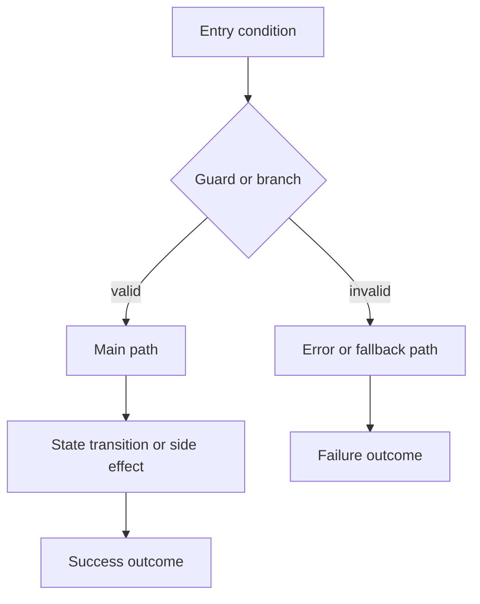

# Báo Cáo Trace Bug

Viết nội dung bằng tiếng Việt. Giữ nguyên technical terms bằng English, gồm code identifiers, API fields, protocol names, schema names, enum values, và các section keys.

## Title

Tiêu đề ngắn gọn cho defect.

## Date

`YYYY-MM-DD`

## Environment

Môi trường và version nơi bug xảy ra: dev / staging / prod, branch, commit hash nếu có.

## Symptom

Mô tả cái gì đang hỏng, xuất hiện ở đâu, và ảnh hưởng đến ai.

## Expected Behavior

Hành vi đúng lẽ ra phải xảy ra.

## Evidence Level

Ghi mức evidence mạnh nhất:

- Deterministic failing test
- Reliable local reproduction
- Stack trace or runtime exception
- Logs with correlation
- Concrete wrong output with known input
- Code inspection only

## Evidence

Liệt kê các artifact đã dùng:

- failing test
- stack trace
- logs
- payload
- screenshot
- user steps
- recent git diff or blame on the critical path

## Trace Entry

File, function, request path, job, worker, command, hoặc stack frame chính xác nơi bắt đầu trace.

## Data Flow

```text
Input/Trigger
  -> validation / parsing
  -> service / domain logic
  -> persistence / cache / queue / external API
  -> response / UI state / observable side effect
```

## Data Mapping Analysis

Mô tả cách dữ liệu được map ở từng bước quan trọng. Phải chỉ rõ khi dữ liệu đi qua các layer hoặc giữa các service.

| Boundary | Source Shape | Target Shape | Mapping / Transformation | Status | Notes |
|----------|--------------|--------------|--------------------------|--------|-------|
| controller -> service |              |              |                          |        |       |
| service -> repository |              |              |                          |        |       |
| service A -> service B |            |              |                          |        |       |

Dùng `OK` khi mapping đúng và `Mismatch` khi mapping sai. Kiểm tra tối thiểu:

- field rename mismatches
- dropped or missing fields
- wrong default values
- null vs empty vs omitted semantics
- type casts
- enum or status-code translation
- unit conversion issues
- nested path mismatches
- semantic reinterpretation

Chỉ rõ boundary đầu tiên nơi dữ liệu không còn giữ đúng meaning như kỳ vọng.

## Logic Flow

Dùng Mermaid. Ưu tiên `flowchart TD`.



Sơ đồ phải:

- có entry và terminal nodes
- có guard và branch quan trọng
- có error path hoặc fallback path
- dùng tên node có meaning, không dùng nhãn mơ hồ

## Confirmed Facts

Fact được coi là Confirmed khi có backing từ test, trace, log, hoặc direct code evidence. Fact chỉ có circumstantial evidence thì ghi vào Likely Root Cause.

- Fact 1

## Likely Root Cause

`Because <condition>, <component> produces <wrong behavior>, which leads to <visible symptom>.`

## Rejected Hypotheses

- Hypothesis A: vì sao bị loại

## Impact Radius

- direct callers
- downstream consumers
- shared schemas or types
- adjacent flows with similar risk

## Unknowns

- missing evidence

## Confidence

`High`, `Medium`, hoặc `Low`, kèm một lý do ngắn.

## Recommended Next Step

- fix now
- trace deeper
- contain temporarily
- gather missing evidence first
